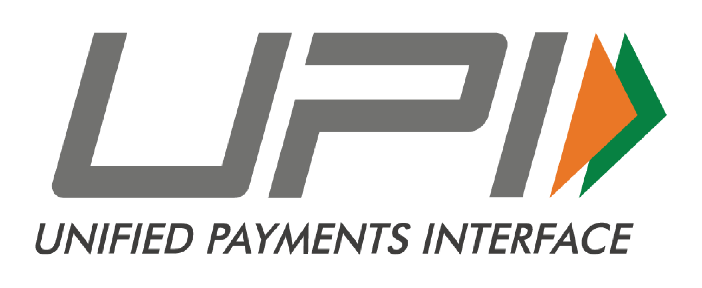
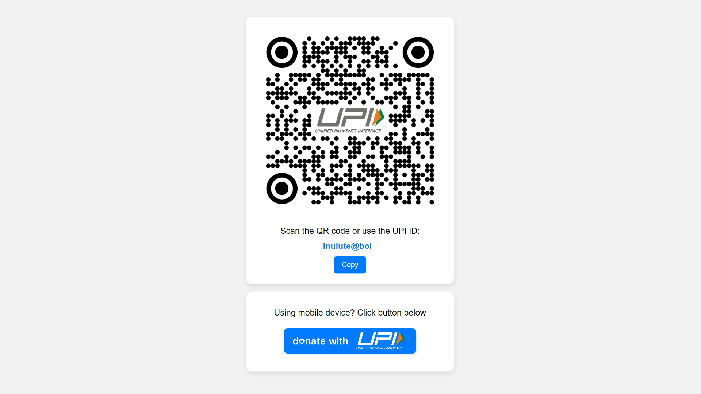

<div align="center">
    
    <h1>UPI Donation Page</h1>
    <p>Simple UPI Details Page with Click-to-Copy functionality to receive UPI Donations.</p>
</div>

<div align="center">
    <!-- Shields.io Badges -->
    
    
</div>

## ✨ Features

- Display a QR code for UPI payments.
- Display a UPI ID along with a "Copy" button for easy copying.
- Responsive design for various screen sizes.
- Easy to use and modify.
- MIT License.
- Free to use.
- No ads.
- No popups.
- No bullshit.


## 🚀 Demo

You can see a live demo of the UPI Payment Page by clicking the button below.

<div align="center">

[](https://inulute.github.io/upi)
</div>


## 📷 Screenshots

<div align="center">



</div>


## 🛠️ Build Your Own

Want to create a similar project? Follow these steps to build your own UPI Payment Page:

1. **Clone the Repository:** Begin by cloning this repository to your local machine using the following command:
   ```sh
   git clone https://github.com/inulute/upi.git
   ```

2. **Navigate to the Project Directory:** Move into the project directory:
   ```sh
   cd your-repo
   ```

3. **Customize Content:** Customize the `index.html` file to include your own QR code, UPI ID, and other content.

4. **Add Styles:** Modify the `styles.css` file to match your preferred styling and design choices.

5. **Test Locally:** Open the `index.html` file in your web browser to test your changes locally.

6. **Deploy:** Once you're satisfied with your changes, you can deploy the project to a hosting platform of your choice.

7. **Share and Contribute:** Share your project with others and consider contributing your enhancements back to the community by creating a GitHub repository.

**That's it!** You've successfully created your own UPI Payment Page. 🎉


<div align='center'>

> [!NOTE]
> *Attribution to this [UPI Payment Page](https://upi-inulute.vercel.app/) project are appreciated.*

</div>

## 💡 Inspiration

This project was inspired by the need for a simple and user-friendly UPI Donation Page. Feel free to add your own creative touch and features!

## 📝 License

This project is licensed under the [MIT License](LICENSE).


## 🤝 Contributing

Contributions are welcome! If you find any issues or want to add enhancements, feel free to submit a pull request.

## ☕ Donate

If you find this project useful, consider buying me a coffee to show your support! 😄

<div align="center">

<a href="https://ko-fi.com/inulute"></a>

<a href="https://www.buymeacoffee.com/inulute" target="_blank"></a> 

<a href="https://www.paypal.me/inulute"></a>

<a href="https://upi-inulute.vercel.app"> </a>

</div>

> [!NOTE]  
> UPI is only available for Indian users.
</div>
